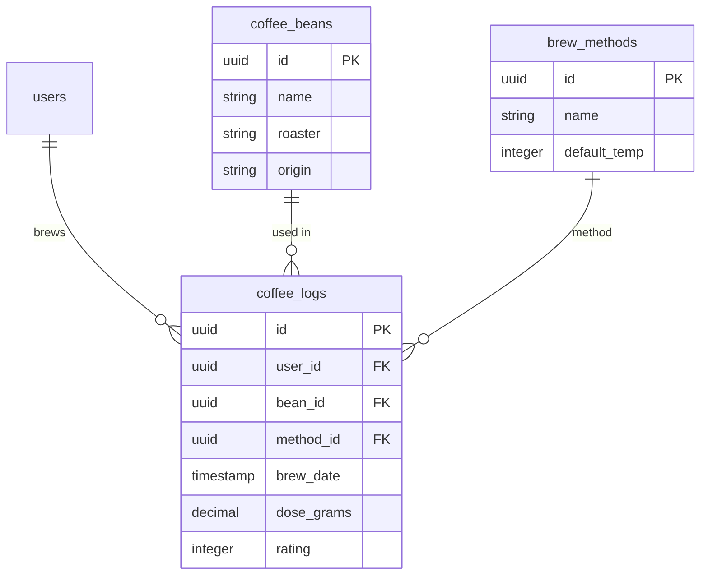

# BrewLog Data Model

## 📊 Database Schema

### coffee_beans

Stores your coffee bean inventory.

| Column        | Type          | Description          |
| ------------- | ------------- | -------------------- |
| id            | UUID          | Primary key          |
| name          | VARCHAR(255)  | Bean name            |
| roaster       | VARCHAR(255)  | Roaster name         |
| origin        | VARCHAR(255)  | Country/region       |
| roast_level   | VARCHAR(50)   | light/medium/dark    |
| process       | VARCHAR(50)   | washed/natural/honey |
| purchase_date | DATE          | When purchased       |
| price         | DECIMAL       | Cost                 |
| rating        | INTEGER (1-5) | Your rating          |
| notes         | TEXT          | Tasting notes        |

### brew_methods

Pre-defined brewing methods with defaults.

| Column       | Type         | Description         |
| ------------ | ------------ | ------------------- |
| id           | UUID         | Primary key         |
| name         | VARCHAR(100) | Method name         |
| default_temp | INTEGER      | Water temp (°C)     |
| default_time | INTEGER      | Brew time (seconds) |
| grind_size   | VARCHAR(50)  | Grind setting       |

### coffee_logs

Individual brew records - the heart of the app.

| Column             | Type          | Description             |
| ------------------ | ------------- | ----------------------- |
| id                 | UUID          | Primary key             |
| user_id            | UUID          | User reference          |
| bean_id            | UUID          | References coffee_beans |
| method_id          | UUID          | References brew_methods |
| brew_date          | TIMESTAMP     | When brewed             |
| dose_grams         | DECIMAL       | Coffee used (g)         |
| yield_grams        | DECIMAL       | Output (g)              |
| brew_time_seconds  | INTEGER       | Actual brew time        |
| water_temp_celsius | INTEGER       | Water temperature       |
| grind_setting      | VARCHAR(50)   | Grinder setting         |
| rating             | INTEGER (1-5) | Brew rating             |
| notes              | TEXT          | Tasting notes           |
| is_public          | BOOLEAN       | Share publicly?         |

### users

User accounts (added in Phase 5).

| Column        | Type         | Description        |
| ------------- | ------------ | ------------------ |
| id            | UUID         | Primary key        |
| email         | VARCHAR(255) | Unique email       |
| password_hash | VARCHAR(255) | Encrypted password |
| name          | VARCHAR(255) | Display name       |
| created_at    | TIMESTAMP    | Account created    |

## 🔗 Relationships



## 📝 TypeScript Types

```typescript
type CoffeeBean = {
  id: string;
  name: string;
  roaster: string;
  origin: string;
  roast_level: "light" | "medium" | "dark";
  process: "washed" | "natural" | "honey" | "anaerobic";
  purchase_date: string;
  price: number;
  rating: number;
  notes: string;
};

type BrewMethod = {
  id: string;
  name: "espresso" | "v60" | "chemex" | "aeropress" | "french-press";
  default_temp: number;
  default_time: number;
  grind_size: string;
};

type CoffeeLog = {
  id: string;
  user_id: string;
  bean_id: string;
  method_id: string;
  brew_date: string;
  dose_grams: number;
  yield_grams: number;
  brew_time_seconds: number;
  water_temp_celsius: number;
  grind_setting: string;
  rating: 1 | 2 | 3 | 4 | 5;
  notes: string;
  is_public: boolean;
};

type User = {
  id: string;
  email: string;
  name: string;
  created_at: string;
};
```

## 🎯 Sample Queries

### Get today's brews

```sql
SELECT cl.*, cb.name as bean_name, bm.name as method_name
FROM coffee_logs cl
JOIN coffee_beans cb ON cl.bean_id = cb.id
JOIN brew_methods bm ON cl.method_id = bm.id
WHERE DATE(cl.brew_date) = CURRENT_DATE
ORDER BY cl.brew_date DESC;
```

### Average rating by method

```sql
SELECT bm.name, AVG(cl.rating) as avg_rating, COUNT(*) as brew_count
FROM coffee_logs cl
JOIN brew_methods bm ON cl.method_id = bm.id
GROUP BY bm.id, bm.name
ORDER BY avg_rating DESC;
```

### Top performing beans

```sql
SELECT cb.name, cb.roaster, AVG(cl.rating) as avg_rating
FROM coffee_beans cb
JOIN coffee_logs cl ON cb.id = cl.bean_id
GROUP BY cb.id, cb.name, cb.roaster
HAVING COUNT(cl.id) >= 3
ORDER BY avg_rating DESC
LIMIT 10;
```
